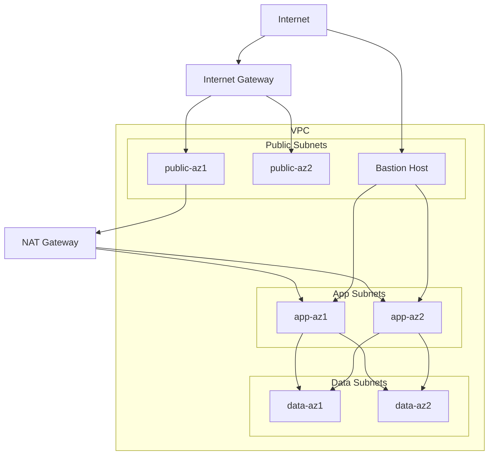

AWS VPC deployed in `us-east-1` with a three-tier architecture across two availability zones.

The security configuration is as follows:
1. Public Subnets routes to 0.0.0.0/0 via Internet Gateway
2. The App subnets are private and do not have direct internet access. Only allowed inbound traffic in the security group is allowed.
3. Database subnets are also private with no internet route possible. Only allowed traffic from the app tier security group.

Web Tier allows HTTP and HTTPS traffic from anywhere, with SSH traffic restricted to a trusted IP address. The outbound traffic is unrestricted. App tier only allows application port from Web tier. Database Tier only allows DB port from App tier. The combination of using distinct subnet tiers for public, private app, and private data with routing tables, an internet gateway, and NAT gateway with least-privilege security groups and NACLs secures and controls the traffic flow between the tiers.